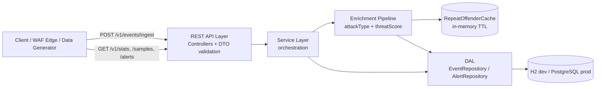

# Mini WSA — High-Level Design (HLD)

**Project:** Mini WSA (Mini Web Security Analytics)
**Stack:** Java 17, Spring Boot 3.x, Spring Data JPA
**Document type:** High-Level Design
**Status:** Draft v1.0

---

## 1. Overview

Mini WSA is a backend service that ingests web security events (DLRs — Data Log Records), enriches them with derived threat intelligence, persists them, and exposes analytics over REST. It is the analytical core of a Web Application Firewall (WAF) telemetry pipeline: raw events describing HTTP requests and the rules they triggered flow in, and aggregated security insight flows out.

**Scope.** The service covers ingestion (single and batch), a synchronous enrichment pipeline, storage behind an abstracted Data Access Layer (DAL), statistics and sample query APIs, and a rule-based alerting subsystem. It deliberately excludes authentication, multi-tenancy, and distributed stream processing — these are noted as future work.

**System context.** Upstream WAF/edge nodes (or the bundled data generator) POST events to the ingest endpoint. Downstream, a SOC dashboard or analyst tooling consumes the stats, samples, and alert APIs.

---

## 2. Architecture Diagram



---

## 3. Component Descriptions

| Layer | Responsibility |
|---|---|
| **REST API (Controllers)** | HTTP binding, DTO deserialization, bean validation, error mapping. Thin — no business logic. |
| **Service Layer** | Orchestrates use cases: ingest, query stats, evaluate alerts. Coordinates enrichment and persistence in a transaction boundary. |
| **Enrichment Pipeline** | Pure(ish) transformation: maps category → attackType, computes threatScore, sets receivedAt, consults the repeat-offender check. |
| **DAL** | Spring Data JPA interfaces abstracting persistence. The only component aware of the physical store. |
| **RepeatOffenderCache** | Interface for fast "events from this IP in last 10 min" lookups; in-memory default, Redis-swappable. |
| **Storage** | H2 (dev/test) or PostgreSQL (prod), selected by Spring profile. |
| **Data Generator** | Spring component that synthesizes realistic events and attack bursts for demos and load testing. |

---

## 4. Data Flow

1. **Ingest.** Client POSTs a single event or array to `/v1/events/ingest`. The controller binds to `IngestRequest` DTO(s).
2. **Validate.** Bean Validation (`@NotNull`, `@Pattern` for IP, `@Min/@Max` for statusCode) rejects malformed payloads with `400`.
3. **Enrich.** For each event the pipeline derives `attackType`, queries the repeat-offender count, computes `threatScore`, and stamps `receivedAt`.
4. **Store.** The service persists enriched entities via `EventRepository.saveAll`, inside a single transaction for the batch.
5. **Query.** `/v1/stats/summary` runs DB-level GROUP BY aggregations; `/v1/events/samples` returns paged/top-N rows; `/v1/alerts/evaluate` counts windowed matches per rule.

---

## 5. Domain Model

| Field | Type | Notes |
|---|---|---|
| eventId | String (UUID) | Primary key |
| timestamp | Instant | Event occurrence time (indexed) |
| configId / policyId | String | WAF config & policy refs |
| clientIp | String | Source IP (indexed) |
| hostname / path / method | String | Request target |
| statusCode | int | HTTP response code |
| userAgent | String | Client UA |
| rule | embedded | id, name, message, severity, category |
| action | String | DENY, ALERT, MONITOR |
| geoLocation | embedded | country, city |
| requestSize / responseSize | long | Bytes |
| **attackType** | String | *Enriched* — from rule.category |
| **threatScore** | int (0–100) | *Enriched* |
| **receivedAt** | Instant | *Enriched* — server ingest time |

`rule` and `geoLocation` are JPA `@Embeddable` value objects.

---

## 6. Storage Design

**Default — H2 in-memory.** Zero configuration, ideal for unit/integration tests and local dev. Schema auto-generated via JPA DDL.

**Production — PostgreSQL.** Justified by: (a) **relational aggregations** — efficient `GROUP BY` for the stats API; (b) **time-range indexing** on `timestamp` for windowed queries; (c) wide community support and simple Docker Compose integration.

**Schema sketch.**

```sql
events(
  event_id PK, timestamp, config_id, policy_id, client_ip,
  hostname, path, method, status_code, user_agent,
  rule_id, rule_name, rule_message, rule_severity, rule_category,
  action, geo_country, geo_city,
  request_size, response_size,
  attack_type, threat_score, received_at
)
alert_rules(id PK, name, category, threshold, window_minutes)
```

**Index strategy.** `idx_events_timestamp`, `idx_events_client_ip`, composite `idx_events_ip_timestamp` (accelerates repeat-offender query), `idx_events_config_id`, `idx_events_category`.

---

## 7. IoC / DAL Abstraction

All persistence is reached through interfaces, so the engine is injectable via Spring's IoC container — a client swaps databases by setting `spring.profiles.active`, never by editing code.

| Interface | Role |
|---|---|
| `EventRepository extends JpaRepository<EnrichedEvent, String>` | CRUD + derived aggregation queries (`countByClientIpAndTimestampAfter`, GROUP BY projections via `@Query`). |
| `AlertRepository extends JpaRepository<AlertRule, String>` | Alert rule CRUD. |
| `RepeatOffenderCache` | `int recentCount(String ip)` / `void record(String ip)`; in-memory default impl. |

**Profile wiring.** `application-h2.yml` and `application-postgres.yml` carry datasource config. `RepeatOffenderCache` has `InMemoryRepeatOffenderCache` annotated `@Profile("!redis")` and a future `RedisRepeatOffenderCache` `@Profile("redis")` — swappable by config alone.

---

## 8. Enrichment Pipeline

**attackType mapping.**

| rule.category | attackType |
|---|---|
| INJECTION | SQL/Command Injection |
| XSS | Cross-Site Scripting |
| PROTOCOL_VIOLATION | Protocol Anomaly |
| DATA_LEAKAGE | Data Exfiltration |
| BOT | Bot Activity |
| DOS | Denial of Service |
| RATE_LIMIT | Rate Limiting |

**threatScore formula (clamped 0–100):**

```
score  = severityWeight(rule.severity)     // CRITICAL=40, HIGH=30, MEDIUM=20, LOW=10
score += actionWeight(action)              // DENY+20, ALERT+10, MONITOR+0
score += pathHeuristic(path)              // contains /admin or /login → +15
score += repeatOffenderBonus(clientIp)    // >5 events from IP in last 10 min → +15
threatScore = min(100, max(0, score))
```

**Repeat-offender strategy (dual).** For **correctness**, `EventRepository.countByClientIpAndTimestampAfter(ip, now-10m)`. For **performance** on the hot path, `RepeatOffenderCache` (ConcurrentHashMap of IP → count with TTL eviction) answers without a DB round-trip.

---

## 9. Alerting (Bonus)

**Rule schema:** `{ id, name, category, threshold (N), windowMinutes (Y) }`, stored in `alert_rules` and managed via `POST /v1/alerts/define`.

**Evaluate (`GET /v1/alerts/evaluate`).** For each rule, count events matching `category` within the last `windowMinutes`. If `count > threshold`, the rule is **FIRING**; otherwise **OK**.

---

## 10. Scalability & Performance

- **Repeat-offender cache** removes per-event DB count from the hot path; TTL eviction bounds memory.
- **Stats via GROUP BY.** Aggregations execute in the database — never by loading rows into the JVM.
- **Batch ingestion** uses `saveAll` within one transaction to amortize round-trips.
- **Indexes** on `timestamp` and `(client_ip, timestamp)` keep windowed queries sub-linear.
- Future: async ingest queue, table partitioning by time.

---

## 11. Security Considerations

Per the assignment, no authentication is required. Implemented controls: strict **input validation** (bean validation on every DTO field, IP/method pattern checks, size bounds), parameterized JPA queries (no SQL injection from the pipeline itself). **Future hardening:** API-key or OAuth2, rate limiting at gateway, PII retention policy for IPs/geo data, audit logging of alert-rule changes.

---

## 12. Testability

- **Unit tests** target the enrichment logic (threatScore boundaries, attackType mapping, repeat-offender bonus) — pure functions with no I/O.
- **Mock DAL pattern.** Persistence sits behind interfaces, so services are tested with Mockito mocks, isolating business logic.
- **Integration tests** run against H2 (auto-configured), exercising controller → service → DAL end-to-end.
- **Slice tests** (`@WebMvcTest` for controllers, `@DataJpaTest` for repositories) keep feedback fast.

---

## 13. Git Checkpoint Strategy

| Tag | Milestone |
|---|---|
| `v0.1-ingestion` | Ingest endpoint, DTOs, validation, persistence |
| `v0.2-enrichment` | attackType mapping + threatScore + repeat-offender |
| `v0.3-stats` | `/v1/stats/summary` GROUP BY aggregations |
| `v0.4-samples` | `/v1/events/samples` query API |
| `v0.5-alerts` | Alert define + evaluate (bonus) |
| `v0.6-generator` | Data generator with attack-wave simulation |
| `v0.7-tests` | Unit + integration test suites |

---

*End of document.*
